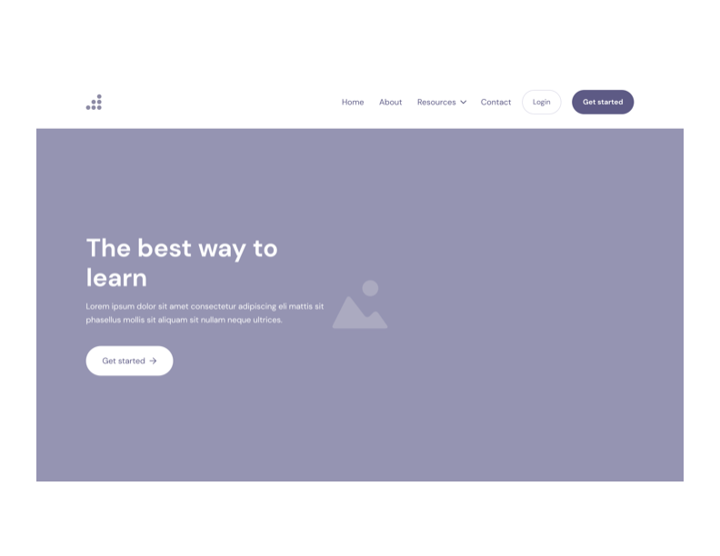
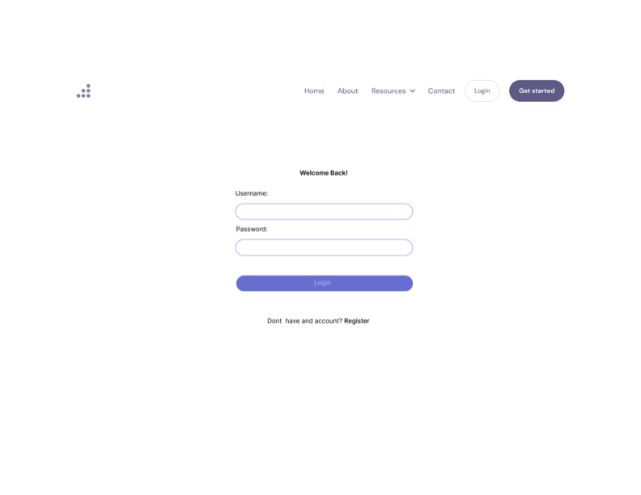
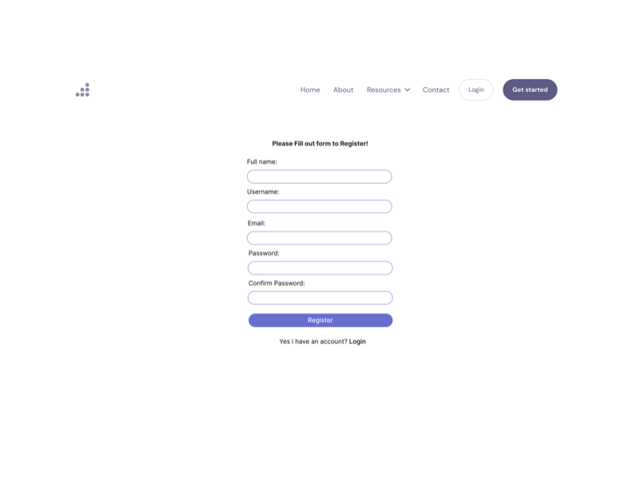
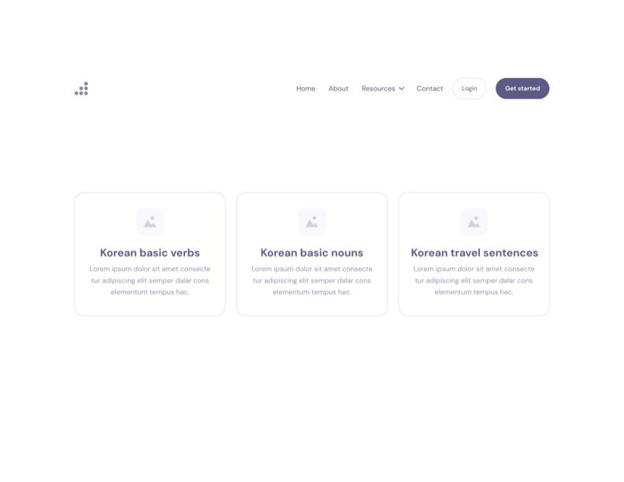
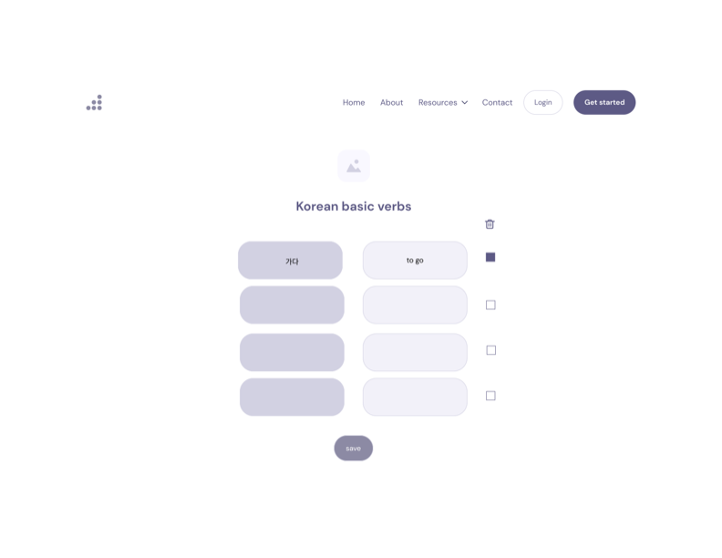
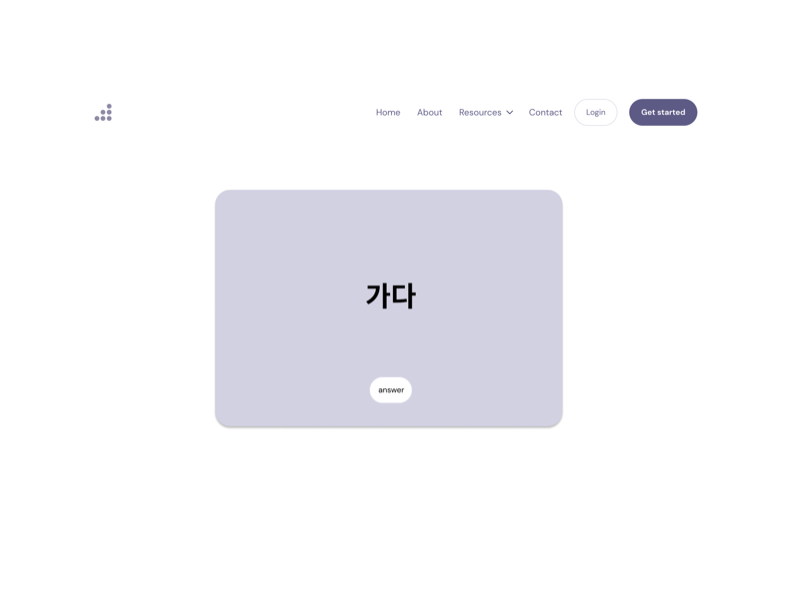

# Gongbu

## Overview

'Gongbu' is a korean word, meaning "Study". As a Korean, I know the struggles to learn a new language. There are many resources but you are not sure what to look at, not sure if you are actually learning or not... Is this you right now? Then this web app is for you!

Gongbu is a web app that will allow users to keep track of their learning journey with fun. Users can register and login. Once they are logged in, they can create their own list or look at other people's lists. For their own list, they can add the items or delete the items.

## Data Model

The application will store Users and their customized lists.

- Users can have multiple lists
  - their own lists that they can add or delete, each list can have multiple items

An Example User:

```javascript
{
  username: "leahchung1",
  hash: // a password hash,
  lists: // an array of references to List documents
}
```

An Example List with Embedded Items:

```javascript
{
  user: // a reference to a User object
  name: "Korean basic verbs",
  items: [
    { name: "가다", meaning: "to go", memorized: false},
    { name: "먹다", quantity: "to eat", memorized: true},
  ],
  createdAt: // timestamp
}
```

## [Link to Commented First Draft Schema](src/db.mjs)


## Wireframes

- /main - main page

  

- /login - login page

  

- /register - register page

  

- /lists - lists of cards

  

- /lists/edit - edit a list

  

- /list/cards - flash cards

  


## Site Map

Here's a basic text-based site map to help you understand the structure of my project:

- **Home**
  - Welcome page
- **home/login**
  - login page
- **home/register**
  - register page
- **home/list**
  - Display the current lists if user logged in
  - List 1
  - List 2
  - List 3
  - users can add and delete a list on this page
- **home/lists/edit**
  - the query param will be /lists/edit?listID=1
  - users can add or delete an item of lists on this page
  - if they add:
  - user input 1. a korean word
  - user input 2. the meaning of the korean word
  - if they delete:
  - simply click the checkbox next to each item
  - to save changes:
  - save button - update the list that users just added or deleted
- **lists/cards?category=korean-basic-verbs**
  - Display the korean words of each list as flash cards
  - Item 1 - korean word
  - if user clicks the button, show the meaning
  - Item 1 - it's meaning
  - Show little animation when they are done with the flash cards

## User Stories or Use Cases

1. as non-registered user, I can register a new account at /register
2. as a user, I can log in to the site at /login
3. as a user, I can add and delete a list if I logged in
4. as a user, I can add and delete an item of lists if I logged in
5. as a user, I can view all of the words lists I've created in a single list
6. as a user, I can study with the flash cards that I've created

## Research Topics

- (5 points) Integrate user authentication
  - I'm going to be using passport for user authentication
  - And account has been made for testing; I'll email you the password.
- (2 points) tailwind.css
  - will learn how to master tailwind.css for better CSS styles. It's also one of the biggest CSS frameworks.
- (6 points) React and Next.js
  - will use React and Next.js overall, they are the biggest and most powerful frameworks combination so I assign 6 points to it.

13 points total, but max points are 10 so 10 points worth.

## [Link to Initial Main Project File](src/app.mjs)

## Annotations / References Used

1. [passport.js authentication docs](http://passportjs.org/docs)
2. [tutorial on next.js](https://nextjs.org/learn/dashboard-app)
3. [tutorial on tailwind.css](https://tailwindcss.com/docs/installation)
